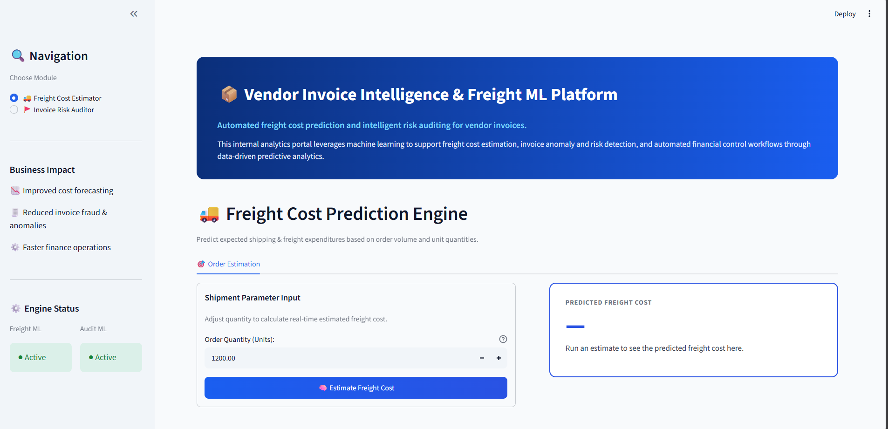
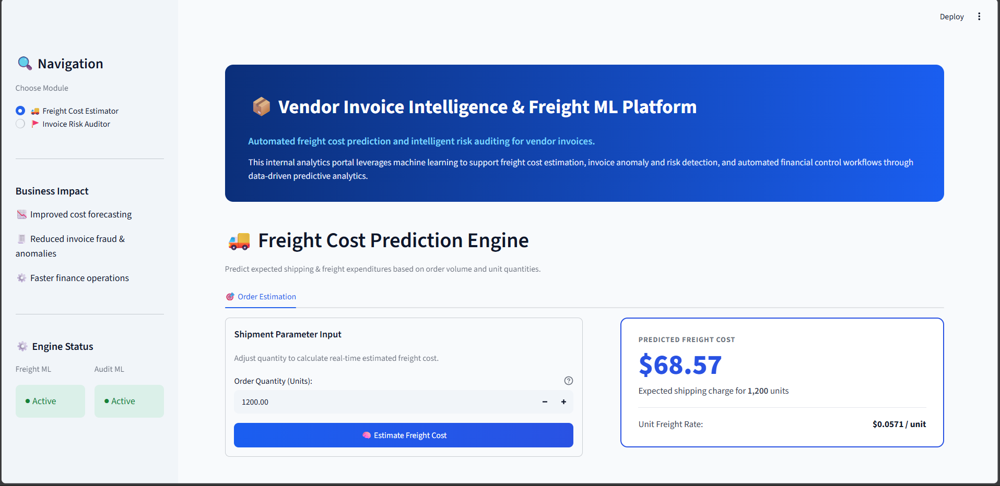
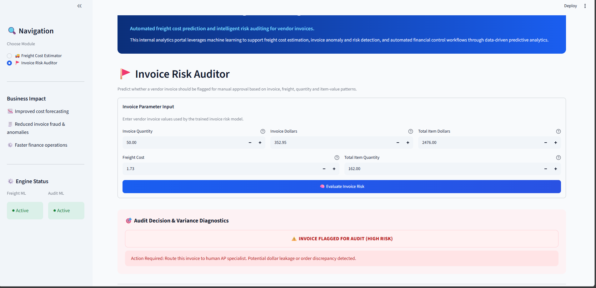

# 📦 Vendor Invoice Intelligence & Freight ML Platform

An end-to-end machine learning platform for **freight cost prediction and vendor invoice risk auditing**, built with Python, Scikit-learn, and Streamlit.

The platform combines two independent machine learning workflows into a single modular web application:

- 🚚 **Freight Cost Estimator** — predicts expected freight cost from order quantity.
- 🚩 **Invoice Risk Auditor** — identifies vendor invoices that should be flagged for manual approval based on invoice, freight, quantity, and item-value patterns.

The project is designed with a **modular application architecture**, separating the Streamlit interface, reusable UI components, views, model loading, inference logic, and machine learning pipelines.

---

## Project Overview

Vendor invoice processing can involve significant manual effort when estimating expected freight expenses and identifying invoices that may contain unusual cost or quantity patterns.

This project addresses these workflows using machine learning.

The platform provides:

### 🚚 Freight Cost Prediction

A regression-based ML pipeline that evaluates multiple regression algorithms and predicts the expected freight cost for a given order quantity.

### 🚩 Invoice Risk Flagging

A classification-based ML pipeline that evaluates vendor invoice information and determines whether an invoice should be flagged for manual review.

The complete workflow follows:

```text
Data
  ↓
Data Preprocessing
  ↓
Feature Engineering
  ↓
Model Training
  ↓
Model Evaluation
  ↓
Best Model Selection
  ↓
Model Serialization
  ↓
Inference
  ↓
Streamlit Application
```

---

# 🎯 Key Objectives

The platform is designed around three primary business objectives:

- 📈 **Improved cost forecasting**
- 🔎 **Reduced invoice anomalies and risk**
- ⚡ **Faster finance and invoice-review operations**

Instead of requiring users to interact directly with notebooks or Python scripts, the trained models are exposed through an interactive Streamlit application.

---

# 🧠 Machine Learning Modules

## 1. 🚚 Freight Cost Prediction

The Freight Cost Prediction module uses regression models to estimate the expected freight cost associated with an order.

### Input

The current application accepts:

```text
Order Quantity (Units)
```

The quantity is passed through the inference pipeline and the trained freight model generates the expected freight cost.

The application then displays:

- Predicted freight cost
- Expected shipping charge
- Unit freight rate

### Example

For an order quantity of:

```text
1,200 units
```

the application produces a predicted freight cost and calculates the corresponding freight cost per unit.

---

# 📊 Freight Model Evaluation

Three regression algorithms were evaluated for the freight cost prediction task:

1. Linear Regression
2. Decision Tree Regression
3. Random Forest Regression

The models were evaluated using:

- **MAE — Mean Absolute Error**
- **RMSE — Root Mean Squared Error**
- **R² — Coefficient of Determination**

### Model Comparison

| Model | MAE | RMSE | R² |
|---|---:|---:|---:|
| Linear Regression | 85.10 | 229.25 | 89.82% |
| Decision Tree Regression | 89.15 | 251.13 | 87.79% |
| **Random Forest Regression** | **84.51** | 236.58 | 89.16% |

The project selected and saved the **Random Forest Regression** model as the final freight prediction model.

```text
models/
└── predict_freight_model.pkl
```

### Why Multiple Models Were Evaluated

Rather than assuming a single algorithm would perform best, the pipeline evaluates multiple regression approaches and compares their performance using consistent evaluation metrics.

This provides a model-selection step before the final model is serialized for inference.

---

# 2. 🚩 Invoice Risk Auditor

The Invoice Risk Auditor is a classification pipeline designed to determine whether a vendor invoice should be flagged for manual review.

The application collects the following invoice-level parameters:

| Feature | Description |
|---|---|
| Invoice Quantity | Quantity recorded on the vendor invoice |
| Invoice Dollars | Monetary value associated with the invoice |
| Freight Cost | Freight amount associated with the invoice |
| Total Item Quantity | Total quantity of items associated with the transaction |
| Total Item Dollars | Total monetary value of the associated items |

These values are passed to the trained classification model.

The resulting prediction is converted into an audit decision within the Streamlit interface.

---

# 📊 Invoice Classification Performance

The invoice risk model uses a **Random Forest Classifier**.

The model achieved:

| Metric | Score |
|---|---:|
| Accuracy | **0.89** |
| Macro Precision | **0.91** |
| Macro Recall | **0.85** |
| Macro F1 | **0.87** |
| Weighted Precision | **0.90** |
| Weighted Recall | **0.89** |
| Weighted F1 | **0.88** |

### Class-Level Performance

| Class | Precision | Recall | F1-Score | Support |
|---|---:|---:|---:|---:|
| 0 | 0.86 | 0.98 | 0.92 | 725 |
| 1 | 0.96 | 0.71 | 0.81 | 384 |

The classification model achieved an overall accuracy of **89%** on the evaluated test set containing **1,109 observations**.

The model's class-level metrics are also exposed here because accuracy alone does not fully describe classification behavior.

---

# 🔄 Invoice Risk Workflow

```text
Vendor Invoice Parameters
          ↓
Data Preparation
          ↓
Feature Transformation
          ↓
Random Forest Classifier
          ↓
Prediction
          ↓
Audit Decision
```

The Streamlit application converts the model prediction into a business-oriented result.

For example:

```text
⚠️ INVOICE FLAGGED FOR AUDIT
```

The application then communicates that the invoice should be routed for additional human review.

---

# 🖥️ Application Interface

The platform uses **Streamlit** as the application framework and custom CSS to create an enterprise-style interface.

The interface follows an **Off-White & Blue** visual design.


The application contains:

- Navigation sidebar
- Module selection
- Business impact section
- ML engine status indicators
- Hero banner
- Structured parameter input cards
- Prediction result cards
- Invoice audit decision cards
- Custom CSS styling

---

# 📸 Application Screenshots

## Initial Application Interface

The application opens with the main platform interface before a prediction is submitted.



---

## Freight Cost Prediction

The Freight Cost Estimator allows users to enter an order quantity and generate an expected freight cost.



The result card displays the predicted freight cost along with the calculated unit freight rate.

---

## Invoice Risk Audit

The Invoice Risk Auditor accepts invoice and item-level parameters and generates an automated audit decision.



A flagged invoice is presented as requiring manual review.

---

# 🏗️ Application Architecture

A major focus of this implementation is **modularity**.

Instead of placing the entire Streamlit application inside a single `app.py`, the project separates the interface into reusable components and views.

The architecture can be summarized as:

```text
                    ┌───────────────────────┐
                    │      Streamlit UI     │
                    │        app.py         │
                    └───────────┬───────────┘
                                │
                ┌───────────────┴───────────────┐
                │                               │
                ▼                               ▼
       ┌─────────────────┐             ┌─────────────────┐
       │ Freight View    │             │ Invoice View    │
       │ freight_view.py │             │ invoice_view.py │
       └────────┬────────┘             └────────┬────────┘
                │                               │
                └───────────────┬───────────────┘
                                ▼
                     ┌────────────────────┐
                     │   Inference Layer  │
                     │                    │
                     │ predict_freight    │
                     │ predict_invoice    │
                     └─────────┬──────────┘
                               │
                               ▼
                     ┌────────────────────┐
                     │   Model Loader     │
                     │  model_loader.py   │
                     └─────────┬──────────┘
                               │
                    ┌──────────┴──────────┐
                    ▼                     ▼
             Freight Model          Invoice Model
             .pkl artifact          .pkl artifact
```

This separation allows the UI, inference layer, and ML training pipelines to evolve independently.

---

# 📁 Project Structure

```text
Invoice Intelligent system
│
├── .streamlit
│   └── config.toml
│
├── app.py
│
├── components
│   ├── audit_card.py
│   ├── hero_banner.py
│   ├── predicted_card.py
│   ├── sidebar.py
│   └── __init__.py
│
├── config.py
│
├── core
│   ├── model_loader.py
│   └── __init__.py
│
├── data
│
├── models
│   ├── predict_flag_invoice.pkl
│   ├── predict_freight_model.pkl
│   └── scaler.pkl
│
├── notebooks
│   ├── InvoiceFlagging.ipynb
│   └── Predicitng-frieght-cost.ipynb
│
├── README.md
│
├── requirements.txt
│
├── screenshots
│   ├── 01_initial_ui.png
│   ├── 02_freight_prediction.png
│   └── 03_invoice_risk_audit.png
│
├── src
│   ├── Freight_cost_prediction
│   │   ├── Data_preprocessing.py
│   │   ├── model_evaluation.py
│   │   └── train.py
│   │
│   ├── Inferencing
│   │   ├── predict_freight.py
│   │   └── predict_invoiceflag.py
│   │
│   └── Invoice_flagging
│       ├── data_preprocessing.py
│       ├── modeling_evaluation.py
│       └── train.py
│
├── styles.py
│
└── views
    ├── freight_view.py
    ├── invoice_view.py
    └── __init__.py
```

---

#  Modular Application Components

## `app.py`

The main Streamlit entry point.

It coordinates the application and connects the different UI modules.

The file is intentionally kept separate from individual UI components and ML inference logic.

---

## `components/`

Contains reusable UI components.

### `sidebar.py`

Handles:

- Navigation
- Module selection
- Business impact section
- Engine status indicators

### `hero_banner.py`

Contains the main application hero section:

> Vendor Invoice Intelligence & Freight ML Platform

and the platform description.

### `predicted_card.py`

Handles the presentation of freight prediction results.

### `audit_card.py`

Handles the presentation of invoice audit decisions.

---

#  Views Layer

The `views/` directory contains the UI logic for individual business modules.

## `freight_view.py`

Responsible for the Freight Cost Estimator interface.

It handles:

```text
Quantity Input
      ↓
Prediction Trigger
      ↓
Freight Inference
      ↓
Prediction Result
      ↓
Result Card
```

---

## `invoice_view.py`

Responsible for the Invoice Risk Auditor interface.

It handles:

```text
Invoice Inputs
      ↓
Risk Model Inference
      ↓
Risk Flag
      ↓
Audit Decision
      ↓
Audit Card
```

---

#  Core Layer

## `core/model_loader.py`

The model-loading layer is responsible for loading the serialized machine learning artifacts used during inference.

This keeps model-loading logic separate from the presentation layer.

The application can therefore load the required models without embedding model-loading implementation directly into every view.

---

#  Configuration

## `config.py`

Centralizes application-level configuration.

This helps avoid scattering configuration values throughout the project and makes future changes easier to manage.

---

#  Machine Learning Pipeline

The project maintains separate training pipelines for the two ML tasks.

---

## Freight Cost Prediction Pipeline

```text
src/Freight_cost_prediction/

Data_preprocessing.py
        ↓
train.py
        ↓
model_evaluation.py
        ↓
Best Model
        ↓
predict_freight_model.pkl
        ↓
Inference
```

### `Data_preprocessing.py`

Handles preparation of the data required by the freight prediction pipeline.

### `train.py`

Trains the candidate regression models.

### `model_evaluation.py`

Evaluates the regression models using:

- MAE
- RMSE
- R²

The evaluated models are:

```text
Linear Regression
Decision Tree Regression
Random Forest Regression
```

The final saved model is:

```text
models/predict_freight_model.pkl
```

---

#  Invoice Risk Classification Pipeline

```text
src/Invoice_flagging/

data_preprocessing.py
        ↓
train.py
        ↓
modeling_evaluation.py
        ↓
Random Forest Classifier
        ↓
predict_flag_invoice.pkl
        ↓
Inference
```

### `data_preprocessing.py`

Prepares the invoice-level data and features used by the classifier.

### `train.py`

Handles model training.

### `modeling_evaluation.py`

Evaluates the classification model using:

- Accuracy
- Precision
- Recall
- F1-score

The trained model is stored as:

```text
models/predict_flag_invoice.pkl
```

---

#  Inference Layer

The project separates trained-model inference from the Streamlit views.

```text
src/Inferencing/
├── predict_freight.py
└── predict_invoiceflag.py
```

## `predict_freight.py`

Loads the freight prediction model and performs inference using the application input.

```text
Streamlit
   ↓
freight_view.py
   ↓
predict_freight.py
   ↓
predict_freight_model.pkl
   ↓
Freight Prediction
```

---

## `predict_invoiceflag.py`

Loads the invoice classification model and performs inference using the invoice parameters supplied by the user.

```text
Streamlit
   ↓
invoice_view.py
   ↓
predict_invoiceflag.py
   ↓
predict_flag_invoice.pkl
   ↓
Invoice Risk Flag
```

---

#  Model Artifacts

The trained model artifacts are stored in the `models/` directory.

```text
models/
├── predict_flag_invoice.pkl
├── predict_freight_model.pkl
└── scaler.pkl
```

### `predict_freight_model.pkl`

Final saved Random Forest Regression model used for freight prediction.

### `predict_flag_invoice.pkl`

Saved Random Forest Classification model used for invoice risk flagging.

### `scaler.pkl`

Saved scaling artifact used by the corresponding inference workflow.

---

#  Model Evaluation Summary

## Freight Regression

| Model | MAE | RMSE | R² |
|---|---:|---:|---:|
| Linear Regression | 85.10 | 229.25 | 89.82% |
| Decision Tree Regression | 89.15 | 251.13 | 87.79% |
| **Random Forest Regression** | **84.51** | 236.58 | 89.16% |

**Final saved model:** Random Forest Regression

---

## Invoice Classification

### Random Forest Classifier

```text
Accuracy: 0.89
```

| Class | Precision | Recall | F1-Score | Support |
|---|---:|---:|---:|---:|
| 0 | 0.86 | 0.98 | 0.92 | 725 |
| 1 | 0.96 | 0.71 | 0.81 | 384 |
| **Overall** | **0.89** | — | — | **1109** |

### Aggregate Metrics

| Average | Precision | Recall | F1-Score |
|---|---:|---:|---:|
| Macro Avg | 0.91 | 0.85 | 0.87 |
| Weighted Avg | 0.90 | 0.89 | 0.88 |

The class-level metrics are included to provide more detail than accuracy alone, particularly because the two classes have different numbers of observations.

---

#  User Workflow

## Freight Cost Estimation

```text
1. Open the application
        ↓
2. Select "Freight Cost Estimator"
        ↓
3. Enter Order Quantity
        ↓
4. Click "Estimate Freight Cost"
        ↓
5. Model performs inference
        ↓
6. Predicted Freight Cost displayed
        ↓
7. Unit Freight Rate displayed
```

---

## Invoice Risk Auditing

```text
1. Open the application
        ↓
2. Select "Invoice Risk Auditor"
        ↓
3. Enter invoice parameters
        ↓
4. Click "Evaluate Invoice Risk"
        ↓
5. Model performs inference
        ↓
6. Risk flag generated
        ↓
7. Audit decision displayed
```

---

#  Technology Stack

## Programming

- Python

## Machine Learning

- Scikit-learn
- Pandas
- NumPy

## Model Persistence

- Joblib
- Pickle-based serialized model artifacts

## Application

- Streamlit

## Frontend / UI

- Streamlit components
- Custom CSS
- `.streamlit/config.toml`

## Development

- Jupyter Notebook
- Python scripts

---

#  UI Design

The application uses Streamlit for the application layer while custom CSS is used to create the visual design.

The interface follows an Off-White & Blue enterprise-inspired theme.

### Design characteristics

- Clean white cards
- Light gray application background
- Blue primary actions
- Blue-bordered prediction cards
- Dedicated audit-result section
- Sidebar navigation
- Modular input sections
- Status indicators
- Business-oriented terminology

The UI was designed separately from the ML implementation so that future interface improvements can be made without restructuring the underlying model pipelines.

---

#  Business Use Cases

## Freight Cost Forecasting

The freight prediction module can be used to estimate expected shipping expenses based on order quantity.

This can support:

- Cost estimation
- Freight benchmarking
- Invoice review
- Procurement analysis
- Cost variance investigation

---

## Invoice Risk Screening

The invoice classification module can provide an automated first-level screening mechanism for vendor invoices.

Potential applications include:

- Manual approval routing
- Invoice anomaly screening
- Accounts payable review
- Financial control workflows
- Exception handling

---

## Human-in-the-Loop Review

The invoice model is designed as a screening mechanism rather than a replacement for financial review.

A flagged invoice can be routed to a human AP/finance specialist for further investigation.

```text
Invoice
   ↓
ML Risk Screening
   ↓
 ┌───────────────┐
 │               │
 ▼               ▼
Low Risk       Flagged
 │               │
 ▼               ▼
Continue       Human Review
Processing
```

---

#  Design Principles

The project follows several software and ML engineering principles.

### Separation of Concerns

UI, inference, model loading, configuration, and ML training are maintained in separate modules.

### Reusability

Common UI elements are implemented as reusable components.

### Maintainability

Individual modules can be modified without requiring changes across the entire application.

### Model-Agnostic Evaluation

Multiple candidate models are evaluated before selecting the saved model for freight prediction.

### Production-Oriented Inference

The Streamlit application consumes serialized model artifacts through dedicated inference functions rather than retraining models during application execution.

---

#  Future Enhancements

The current architecture provides a foundation for extending the platform.

Potential future improvements include:

###  Analytics

- Freight cost trend dashboard
- Vendor-level freight analysis
- Invoice risk distribution
- Procurement analytics
- Historical prediction analysis

###  Machine Learning

- Hyperparameter optimization
- Model explainability
- SHAP-based feature importance
- Probability-based invoice risk scores
- Model monitoring
- Data drift detection
- Automated retraining

### Invoice Intelligence

- PDF invoice ingestion
- OCR-based invoice extraction
- Automated invoice-to-purchase-order matching
- Invoice field validation
- Duplicate invoice detection

###  Enterprise Features

- Authentication
- Role-based access control
- Audit logs
- Batch invoice processing
- API deployment
- Cloud deployment
- Model version management

---

#  Current Limitations

The current version focuses on model inference through an interactive Streamlit interface.

Potential areas for further development include:

- Automated model monitoring
- Explainability for individual invoice decisions
- Batch prediction
- Automated document ingestion
- Production-grade authentication
- Model/version tracking
- Real-time data pipelines

The invoice classifier should also be treated as a **decision-support mechanism**. A flagged invoice is intended to trigger additional review rather than automatically determine financial approval.

---

#  Installation

## 1. Clone the repository

```bash
git clone <https://github.com/aryanfarswan/Vendor-Invoice-Intelligent-Freight-ML-Platform.git>


---

## 2. Create a virtual environment

### Windows

```bash
python -m venv .venv
```

Activate the environment:

```bash
.venv\Scripts\activate
```

### Linux / macOS

```bash
python3 -m venv .venv
```

```bash
source .venv/bin/activate
```

---

## 3. Install dependencies

```bash
pip install -r requirements.txt
```

The `requirements.txt` file contains the Python dependencies required by the application.

---

# Run the Application

Start the Streamlit application with:

```bash
streamlit run app.py
```

Alternatively:

```bash
python -m streamlit run app.py
```

Streamlit starts the application server and makes the interface available through the browser.

---

#  Deployment

The application can be deployed using Streamlit-compatible hosting infrastructure.

For a repository-based deployment, ensure that:

```text
app.py
requirements.txt
models/
components/
core/
src/
views/
.streamlit/
```

and the required project files are committed to the repository.

The deployment environment must install the dependencies specified in `requirements.txt` and have access to the serialized model artifacts required for inference.

---

#  Repository Organization

The repository is intentionally divided into five major concerns:

```text
┌─────────────────────────────────────┐
│           Presentation              │
│     app.py / components / views     │
└─────────────────┬───────────────────┘
                  │
                  ▼
┌─────────────────────────────────────┐
│             Inference               │
│        src/Inferencing              │
└─────────────────┬───────────────────┘
                  │
                  ▼
┌─────────────────────────────────────┐
│          Model Artifacts            │
│              models/                │
└─────────────────────────────────────┘

Training / Development
        │
        ├── notebooks/
        └── src/
            ├── Freight_cost_prediction/
            └── Invoice_flagging/
```

This structure allows the application layer to remain independent from model-development experimentation.

---

#  Notebooks

The project includes notebooks corresponding to the two machine learning workflows:

```text
notebooks/
├── InvoiceFlagging.ipynb
└── Predicitng-frieght-cost.ipynb
```

These notebooks provide an environment for exploring the data and developing the respective models before integrating them into the application inference pipeline.

---

#  Demo Flow

The complete application workflow can be summarized as:

```text
                    Vendor Invoice
                           │
                           ▼
                ┌─────────────────────┐
                │  Streamlit Portal   │
                └──────────┬──────────┘
                           │
             ┌─────────────┴─────────────┐
             │                           │
             ▼                           ▼
    Freight Cost Estimator       Invoice Risk Auditor
             │                           │
             ▼                           ▼
     Random Forest Model        Random Forest Classifier
             │                           │
             ▼                           ▼
     Freight Cost Estimate          Risk Flag
             │                           │
             ▼                           ▼
       Unit Freight Rate           Audit Decision
```

---

#  Project Highlights

- End-to-end machine learning implementation
- Separate regression and classification workflows
- Freight model comparison across three regression algorithms
- Random Forest selected as the saved freight prediction model
- Random Forest classifier for invoice risk flagging
- Dedicated preprocessing and training modules
- Dedicated inference layer
- Serialized ML model artifacts
- Modular Streamlit architecture
- Reusable UI components
- Separate views for business workflows
- Custom CSS-based enterprise interface
- Business-oriented prediction and audit outputs
- Designed for future extension and deployment

---

#  Author

**Aryan Farswan**

B.Tech — Artificial Intelligence & Machine Learning

---

# 📄 License

This project is intended for educational, portfolio, and demonstration purposes.
